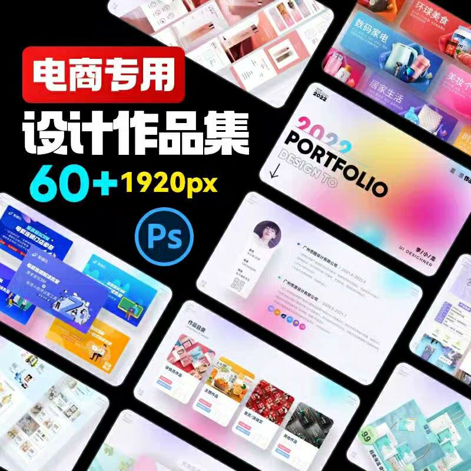
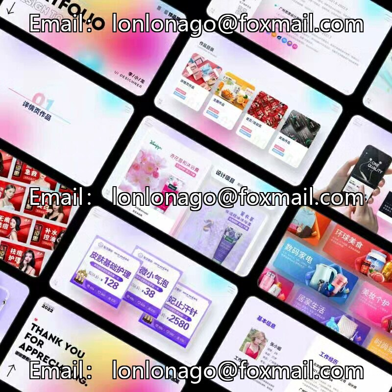

# 【Instant Download】60+ PSD Templates for Adobe Photoshop for Graphic Design Interview Portfolio

This template is designed to help you showcase your graphic design skills and experience in a professional manner. It includes various templates such as resumes, cover letters, portfolios, and more. The templates are easy to customize and can be easily edited using Adobe Photoshop.

The templates are organized into different sections, including personal information, education and certifications, work experience, skills and abilities, and references. You can add your own details and customize the templates according to your needs.

The templates are available in both PSD and PNG formats, so you can choose the one that suits your preference. Additionally, the templates are compatible with most popular graphic design software, such as Adobe Illustrator and InDesign.

Overall, this template is an excellent resource for anyone looking to create a professional-looking design portfolio. With its easy customization options and wide range of templates, you can quickly and easily create a stunning design portfolio that will impress potential employers or clients.

## Body

【Instant Delivery】60+ PSD Packaged Plane E-commerce Graphic Design Interview Design Portfolio Template Resume

This is a collection of 60+ PSD files that are ready to be used as a template for a resume or portfolio for graphic design candidates in the e-commerce sector. The PSD files include various designs such as logos, business cards, social media graphics, product images, and more. These files are optimized for use on various platforms such as LinkedIn, Indeed, Glassdoor, and other job search websites.

The PSD files are designed to be easily editable by graphic designers using popular software like Adobe Photoshop. Each file includes a detailed instructional guide that explains how to edit and customize the design elements to suit the candidate's needs.

These PSD files are perfect for candidates who want to showcase their skills and creativity in a professional manner. They can be used to create a strong first impression on potential employers and increase their chances of landing an interview.

Overall, this package of PSD files provides a comprehensive resource for graphic design professionals looking to enhance their resumes and portfolios. It offers a wide range of designs that can be customized to showcase the candidate's unique skills and experience.

(Full product description was not available from the source page.)

## Images

## Payment

Here is a pay link on Stripe ( https://buy.stripe.com/3cs8yP7sY87d0vu9AB ). Please contact me lonlonago@foxmail.com after funding $89, and I will send you a complete data files , thank you!

